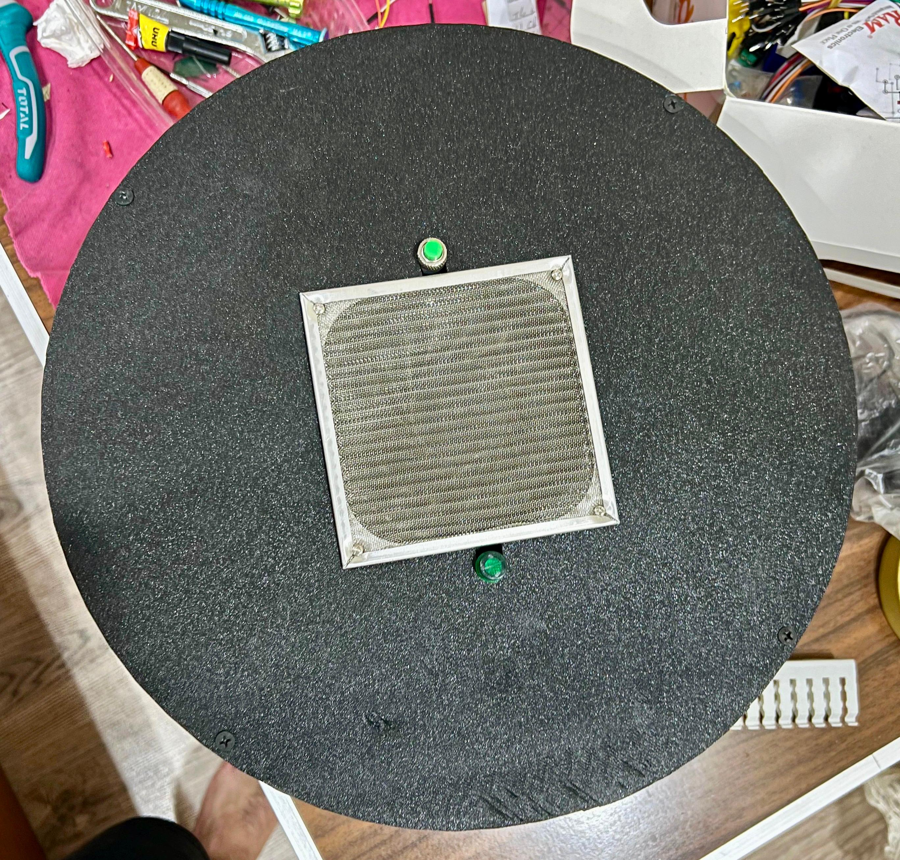
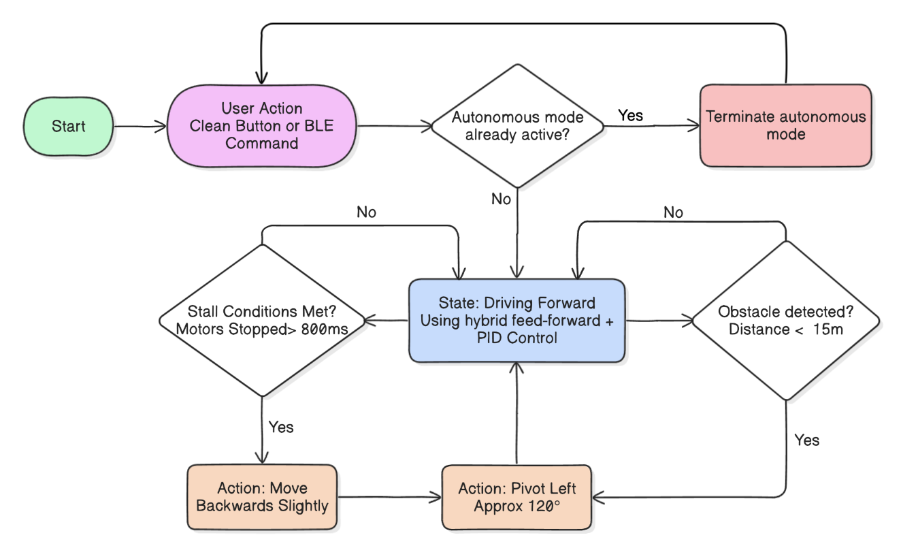
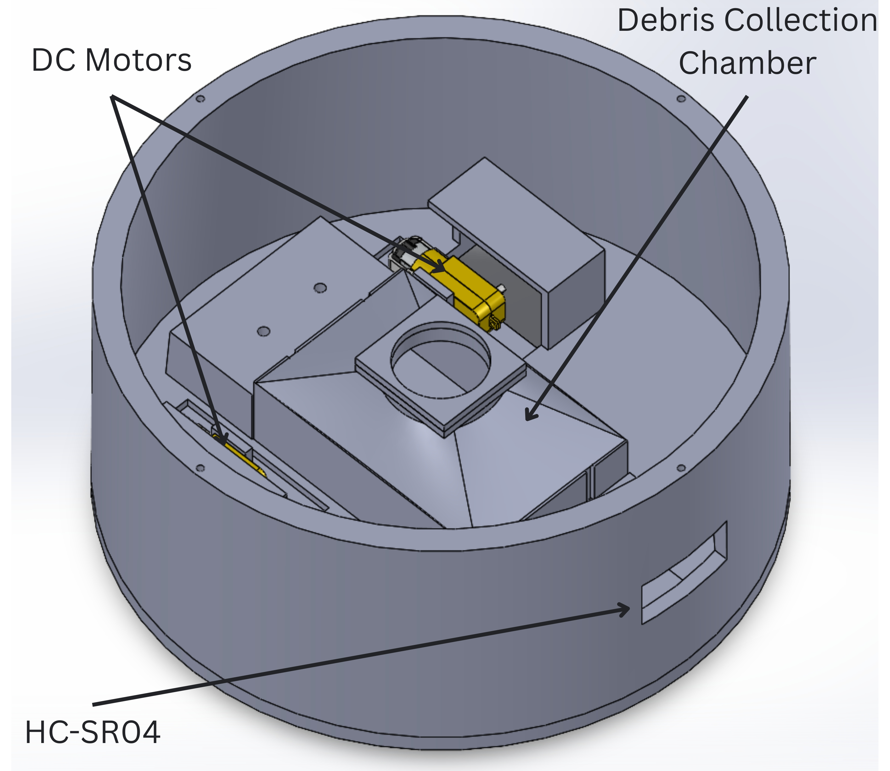
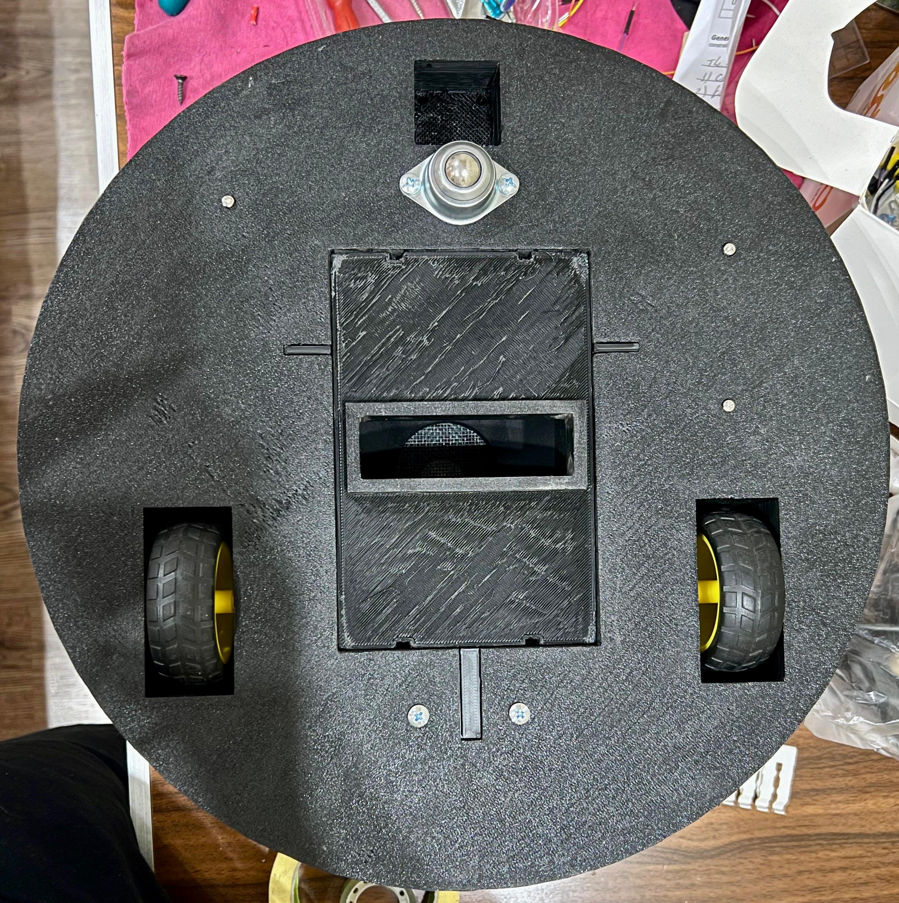
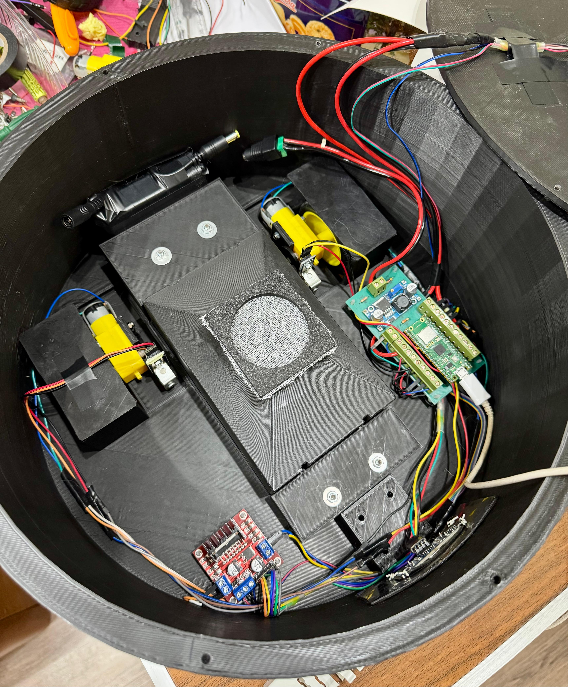
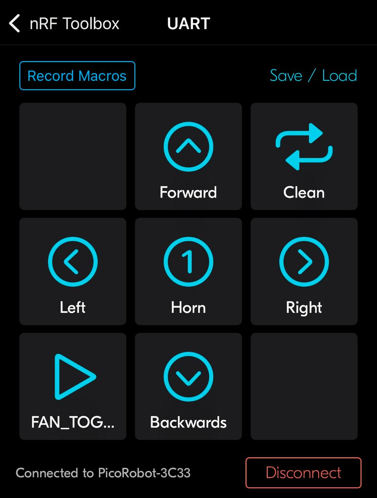
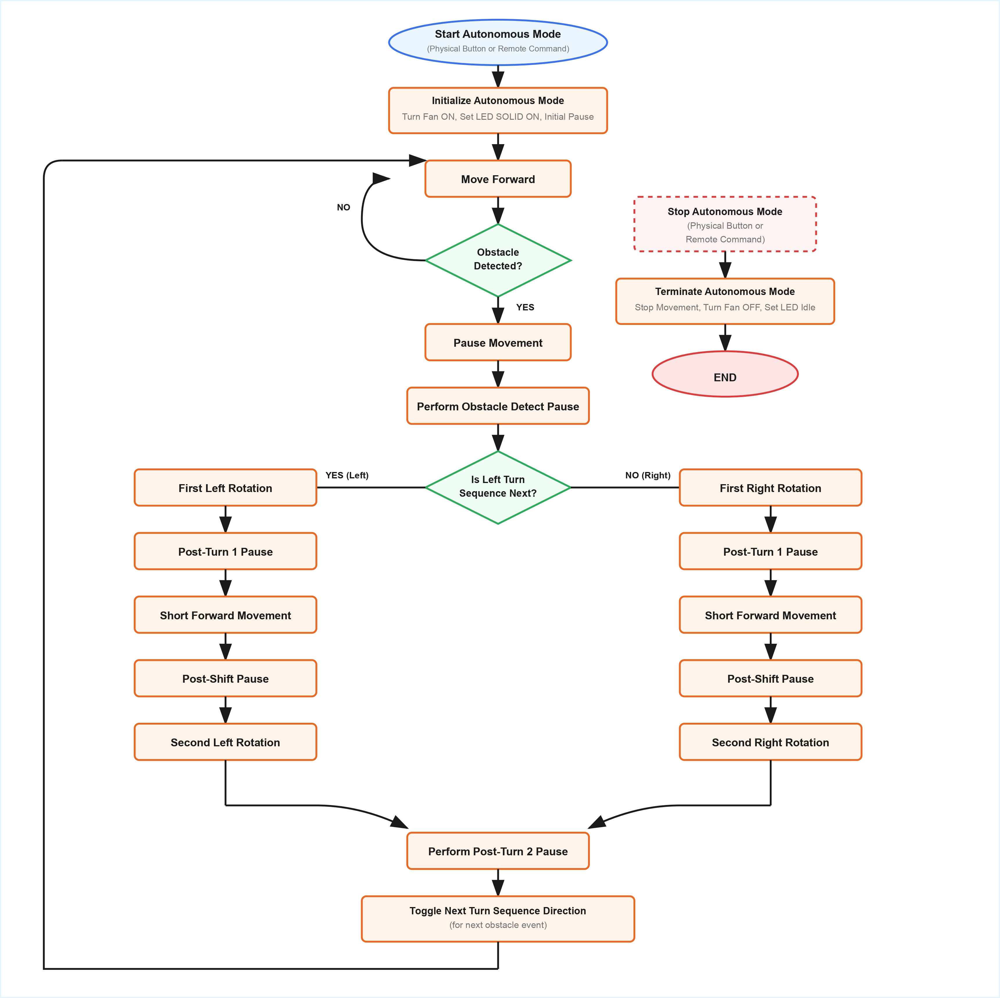

# Smart Cleaning Robot

[](LICENSE)
[](https://micropython.org/)
[](https://github.com/andrew-abdelmalak/smart-cleaning-robot/actions/workflows/lint.yml)

A MicroPython-based autonomous and manual smart cleaning robot built on the Raspberry Pi Pico W.
The system delivers closed-loop differential-drive motion, BLE remote control, and obstacle-aware
autonomous navigation at a build cost of approximately **$80 USD** — 60–90 % cheaper than
comparable commercial platforms.

---

## Table of Contents

1. [Overview](#overview)
2. [Key Results](#key-results)
3. [System Architecture](#system-architecture)
4. [Hardware Specifications](#hardware-specifications)
5. [Pin Mapping](#pin-mapping)
6. [BLE Command Reference](#ble-command-reference)
7. [Repository Structure](#repository-structure)
8. [Getting Started](#getting-started)
9. [Autonomous State Machine](#autonomous-state-machine)
10. [Control Design](#control-design)
11. [Author](#author)
12. [Acknowledgments](#acknowledgments)
13. [Thesis](#thesis)

---

## Overview

<p align="center">
  
</p>

The Smart Cleaning Robot integrates three subsystems on a custom 3D-printed PLA chassis:

| Subsystem | Technology |
|---|---|
| Locomotion | Differential drive · L298N H-bridge · PID wheel balancing |
| Sensing | HC-SR04 ultrasonic (obstacle) · quadrature wheel encoders |
| Communication | BLE UART GATT service · NRF Toolbox compatible |
| Cleaning | 12 V PS3 Slim fan mounted centrally |
| Electronics | Custom KiCad PCB · Raspberry Pi Pico W |

---

## Key Results

| Metric | Value |
|---|---|
| Build cost | ~$80 USD |
| Battery runtime | > 60 minutes |
| Obstacle detection threshold | 15 cm |
| Encoder pulses per turn (pivot) | 39 pulses |
| Straight-line PID gains (P / I / D) | 0.8 / 0.15 / 0.25 |
| Right-wheel feed-forward trim | 0.75 |
| BLE link | Stable at ≥ 10 m indoor range |

### Cost Comparison

| Platform | Approx. Cost (USD) |
|---|---|
| This robot | ~$80 |
| Typical commercial cleaning robot | $200 – $800 |
| Savings | 60 – 90 % |

---

## System Architecture

<p align="center">
  
</p>

The firmware (`main.py`) runs entirely on MicroPython and is structured as:

```
BLE UART service (interrupt-driven)
        │
        ▼
  Command dispatcher
  ├── Manual mode  → direct motor commands
  └── Auto mode    → Autonomous FSM
                        IDLE → START_FWD → FWD
                                             │ obstacle?
                                        START_AVOID → AVOID → STALL_TURN
```

---

## Hardware Specifications

| Component | Part | Notes |
|---|---|---|
| Microcontroller | Raspberry Pi Pico W | MicroPython firmware |
| Motor driver | L298N dual H-bridge | PWM speed + direction pins |
| Drive motors | 2× DC gear motors | Differential drive |
| Wheel encoders | 2× optical encoders | Interrupt-counted |
| Distance sensor | HC-SR04 ultrasonic | TRIG / ECHO |
| Cleaning fan | PS3 Slim fan (12 V) | Centrally mounted |
| Chassis | Custom PLA | 3D-printed, SolidWorks CAD |
| PCB | Custom KiCad board | On-board power regulation |
| Power | Li-ion battery pack | > 60 min runtime |

<p align="center">
  
  &nbsp;&nbsp;
  
</p>

<p align="center">
  
</p>

---

## Pin Mapping

| Signal | GPIO |
|---|---|
| Motor A PWM (ENA) | 6 |
| Motor B PWM (ENB) | 7 |
| Motor A direction IN1 | 12 |
| Motor A direction IN2 | 13 |
| Motor B direction IN3 | 14 |
| Motor B direction IN4 | 15 |
| Left encoder | 21 |
| Right encoder | 20 |
| Fan output | 8 |
| Status LED | 18 |
| Ultrasonic TRIG | 10 |
| Ultrasonic ECHO | 11 |
| User button | 16 |

---

## BLE Command Reference

Connect to the device advertising as **`PicoRobot-XXXX`** using any BLE UART client
(e.g. NRF Toolbox).

| GATT Role | UUID |
|---|---|
| Service | `6E400001-B5A3-F393-E0A9-E50E24DCCA9E` |
| TX (notify, robot → host) | `6E400003-B5A3-F393-E0A9-E50E24DCCA9E` |
| RX (write, host → robot) | `6E400002-B5A3-F393-E0A9-E50E24DCCA9E` |

### Commands

| Command | Action |
|---|---|
| `F` | Move forward |
| `B` | Move backward |
| `L` | Turn left (pivot) |
| `R` | Turn right (pivot) |
| `S` | Stop |
| `A` | Toggle autonomous mode |
| `X` | Emergency stop |
| `+` / `-` | Increase / decrease speed |

<p align="center">
  
</p>

---

## Repository Structure

```
smart-cleaning-robot/
├── main.py                        # MicroPython firmware — robot entry point
├── docs/
│   ├── Thesis.pdf                 # Full bachelor thesis
│   └── figures/                   # Thesis figures (extracted)
│       ├── assembled_robot.jpeg
│       ├── assembled_robot_bottom.jpeg
│       ├── assembled_robot_internal.jpeg
│       ├── chassis_cad.jpeg
│       ├── ble_controller.jpeg
│       ├── control_flowchart.png
│       └── state_machine.jpeg
├── .github/
│   └── workflows/
│       └── lint.yml               # Ruff linter CI
├── LICENSE                        # MIT
└── README.md
```

---

## Getting Started

### Prerequisites

- Raspberry Pi Pico W flashed with [MicroPython ≥ 1.23](https://micropython.org/download/RPI_PICO_W/)
- [Thonny IDE](https://thonny.org/) or `mpremote` for file transfer
- BLE-capable device with NRF Toolbox (iOS / Android) or equivalent

### Installation

1. Flash MicroPython firmware onto the Pico W (hold BOOTSEL while connecting USB).
2. Transfer `main.py` to the board root filesystem:

   ```bash
   # Using mpremote
   mpremote connect /dev/ttyACM0 fs cp main.py :main.py
   ```

3. Reboot the board. It will advertise as `PicoRobot-XXXX`.
4. Connect via BLE and send commands from the table above.

### Safety Notes

- Test with wheels off the ground before floor operation.
- Verify motor wiring polarity before enabling autonomous mode.
- Tune `OBSTACLE_THRESHOLD_CM`, PID gains, and `TURN_PULSES` to your specific build.

---

## Autonomous State Machine

<p align="center">
  
</p>

| State | Behaviour |
|---|---|
| `IDLE` | Waiting for autonomous start command |
| `START_FWD` | Initialises encoder counters and PID |
| `FWD` | Drives straight with closed-loop PID correction |
| `START_AVOID` | Obstacle detected — begins pivot |
| `AVOID` | Executes pivot turn (39 encoder pulses) |
| `STALL_TURN` | Recovers from wheel stall during avoidance |

---

## Control Design

The drive loop uses **feed-forward + PID** correction to keep both wheels at equal speed:

- **Feed-forward**: right-wheel trim constant (`RIGHT_TRIM = 0.75`) compensates for mechanical asymmetry.
- **PID straight** (`P=0.8, I=0.15, D=0.25`): drives error between left and right encoder counts to zero.
- **Target speed**: `MOVEMENT_PPS = 75.0` pulses-per-second.
- **Stall watchdog**: if encoder counts do not increment within the watchdog window, the robot halts and raises an emergency stop.

---

## Author

| Name | Affiliation |
|---|---|
| Andrew Khalil Samuel Abdelmalak | Faculty of Engineering & Materials Sciences, GUC |

---

## Acknowledgments

**Supervisors**

| Role | Name |
|---|---|
| Supervisor | Prof. Dr. Walid Atef Hafez Omran |
| Co-Supervisor | Dr. Hisham Mostafa El Sherif |
| Reviewer | Dr. M. A. Moustafa Hassan |

---

## Thesis

The full bachelor thesis is available at [`docs/Thesis.pdf`](docs/Thesis.pdf).

> *Design and Implementation of a Smart Cleaning Robot* — Andrew Khalil Samuel Abdelmalak,
> Faculty of Engineering & Materials Sciences, German University in Cairo, June 2025.

---

## References

1. H. Choset, "Coverage for robotics — A survey of recent results," *Annals of Mathematics and Artificial Intelligence*, vol. 31, pp. 113–126, 2001.
2. C. Cadena *et al.*, "Past, Present, and Future of Simultaneous Localization and Mapping," *IEEE Transactions on Robotics*, vol. 32, no. 6, pp. 1309–1332, 2016.
3. H. Durrant-Whyte and T. Bailey, "Simultaneous Localization and Mapping: Part I," *IEEE Robotics & Automation Magazine*, vol. 13, no. 2, pp. 99–110, 2006.
4. Raspberry Pi Ltd, "Raspberry Pi Pico W Datasheet," 2022. [Online]. Available: https://datasheets.raspberrypi.com/picow/pico-w-datasheet.pdf
5. STMicroelectronics, "L298 Dual Full-Bridge Driver Datasheet," Rev 10, 2013. [Online]. Available: https://www.st.com/resource/en/datasheet/l298.pdf
6. Cytron Technologies, "HC-SR04 Ultrasonic Sensor Datasheet." [Online]. Available: https://docs.cytron.io/

---

## License

[MIT](LICENSE) © 2026 Andrew Abdelmalak
